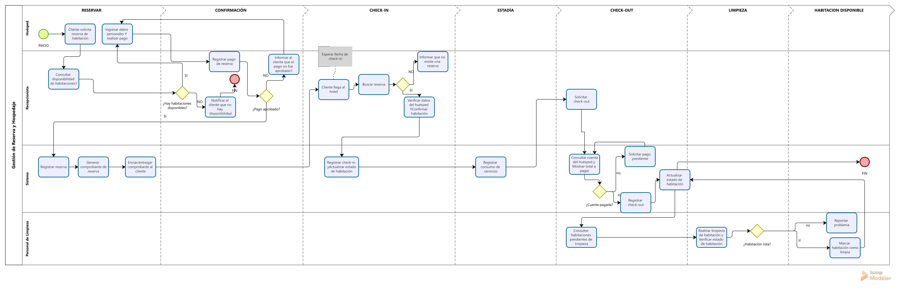

# Sistema de Gestión Hotelera & Analítica (Hotel PMS)

Sistema integral de gestión hotelera diseñado para la administración de reservas, check-in/out, roles de personal, mantenimiento, facturación y analítica de ocupación.

---

## 1. Modelado de Procesos de Negocio (BPMN)

El siguiente diagrama detalla el flujo de trabajo completo del hotel desde la reserva inicial hasta la liberación de la habitación:

### Fases del Proceso:
1. **Reserva & Confirmación:** Verificación de disponibilidad en PostgreSQL, registro de cliente y gestión de pagos.
2. **Check-In:** Registro de huéspedes, acompañantes y asignación de habitación (Estado: Ocupada).
3. **Estadía:** Consumo de servicios adicionales (Restaurante, Minibar, Lavandería) registrados en tiempo real.
4. **Check-Out & Facturación:** Liquidación de habitación + consumos, generación de factura/recibo.
5. **Limpieza & Mantenimiento:** Notificación automática al personal de limpieza (Estado: En Limpieza) y cambio a Disponible tras la inspección.